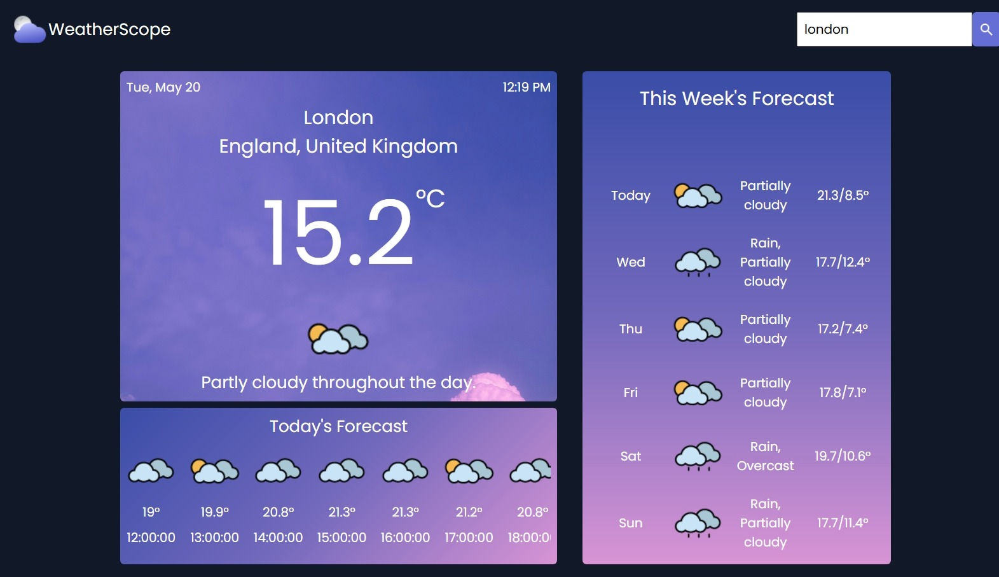

# ⛅ WeatherScope

**WeatherScope** is a weather application that fetches real-time and weekly weather data using the [Visual Crossing Weather API](https://www.visualcrossing.com/). Built with modern JavaScript and styled for clarity, it delivers essential weather details in a user-friendly format.

---

## 🔗 Live Demo

https://fa1sall.github.io/WeatherScope/

---

## 📸 Preview



---

## 🔍 Key Features

- 🔎 Search by city name to get live weather updates
- 🌡️ Shows current temperature and weather condition
- 🕒 Displays hourly forecast for the current day
- 📆 Provides a 7-day forecast including highs, lows, and conditions
- 🖥️ Responsive design for both desktop and mobile views

---

## 🛠️ Built With

- **HTML5** – Markup structure
- **CSS3** – Custom styling with media queries
- **JavaScript (ES6)** – App logic and interactivity
- **Webpack** – Module bundler used to compile and optimize JavaScript and assets for efficient development and production builds
- **[Visual Crossing Weather API](https://www.visualcrossing.com/)** – Real-time weather data
- **[date-fns](https://date-fns.org/)** – Lightweight date formatting and manipulation

---

## 🧠 Concepts Practiced

- API consumption and dynamic data rendering
- Asynchronous programming with `async/await`
- DOM manipulation and component structuring
- Working with time-based data using `date-fns`
- Creating a modular and maintainable codebase

---

## 🚀 Getting Started

### Prerequisites

Make sure you have [Node.js](https://nodejs.org/) and npm installed.

### Installation

```bash
git clone https://github.com/Fa1sall/weatherscope.git
cd weatherscope
npm install
npm run dev
```
